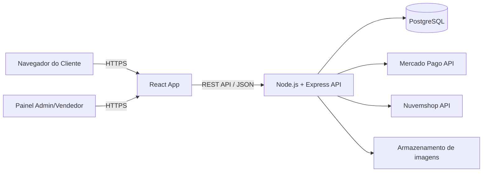
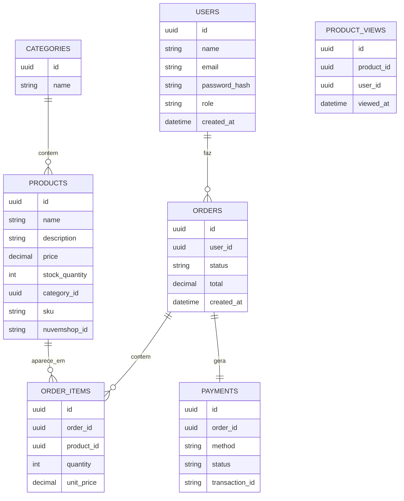

# Plano de Ação — Plataforma de E-commerce
### Manual de planejamento técnico para equipe de 3 desenvolvedores

---

## Como usar este documento

Este manual foi pensado como referência viva. Não precisa ler tudo de uma vez — comecem pela seção "Por onde atacar primeiro" e voltem às outras seções conforme as dúvidas aparecerem. Recomendo colocar este arquivo na raiz do repositório (ex: `DOCS.md` ou dentro de uma pasta `/docs`) para todo o time consultar.

---

## 1. Stack tecnológica recomendada (e por quê)

Vocês estão começando, então a prioridade é escolher ferramentas com **boa documentação, comunidade grande e curva de aprendizado razoável** — não necessariamente a tecnologia "mais avançada". Aqui está a stack sugerida, com a justificativa de cada escolha.

| Camada | Tecnologia | Por que essa escolha |
|---|---|---|
| Frontend | **React + Vite** | React é o framework de UI mais usado no mercado hoje, então há uma quantidade enorme de tutoriais, fóruns e exemplos para qualquer dúvida. Vite é a ferramenta de build moderna, muito mais rápida que alternativas antigas (como Create React App, que já está descontinuado). |
| Estilização | **Tailwind CSS** | Em vez de escrever CSS do zero, vocês escrevem classes utilitárias direto no HTML/JSX (`class="bg-blue-500 p-4"`). Acelera muito o desenvolvimento de telas e evita ficar "perdido" criando arquivos `.css` separados para cada componente. |
| Backend | **Node.js + Express** | Express é o framework backend mais simples de aprender em Node. Como o frontend já será em JavaScript (React), usar Node no backend significa que o time usa **a mesma linguagem nos dois lados**, reduzindo a curva de aprendizado. |
| Banco de dados | **PostgreSQL** | Um e-commerce tem dados fortemente relacionados (pedido → itens do pedido → produto → estoque → usuário). Banco relacional garante que essas relações não fiquem inconsistentes (ex: impossível ter um item de pedido apontando para um produto que não existe). PostgreSQL é gratuito, robusto e o mais usado em aplicações comerciais reais. |
| ORM (acesso ao banco) | **Prisma** | Em vez de escrever SQL puro toda hora, o Prisma permite manipular o banco como objetos JavaScript, gera migrações automaticamente e tem autocomplete no editor. É hoje a ferramenta mais amigável para quem está começando com Node + banco relacional. |
| Autenticação | **JWT (jsonwebtoken) + bcrypt** | JWT é o padrão de mercado para autenticação em APIs (token que o cliente guarda e envia em cada requisição). Bcrypt é a biblioteca padrão para gerar hash de senhas com salt, evitando que senhas fiquem visíveis mesmo se o banco for comprometido. |
| Validação de dados | **Zod** | Toda informação que chega na API (formulários, login, criação de produto) precisa ser validada antes de tocar no banco. Zod permite definir um "esquema" do que é um dado válido e rejeitar automaticamente o que não bate. |
| Pagamentos | **Mercado Pago (Checkout Pro / API)** | É o gateway de pagamento mais usado no Brasil, com suporte nativo a PIX, boleto e cartão, e documentação em português. Usar o checkout hospedado deles (Checkout Pro) evita que vocês precisem manipular dados de cartão diretamente — isso é importante porque lidar com números de cartão exige certificação PCI-DSS, que é inviável para um projeto desse porte. |
| Gráficos (dashboard) | **Recharts** | Biblioteca de gráficos para React, simples de integrar para mostrar os indicadores do painel de métricas (vendas por período, produtos mais vendidos etc). |
| Versionamento | **Git + GitHub** | Já definido por vocês. Detalhamento do fluxo de trabalho na seção 5. |
| Hospedagem (deploy) | Frontend: **Vercel** · Backend: **Render ou Railway** · Banco: **Neon ou Railway (Postgres gerenciado)** | Todas têm planos gratuitos suficientes para um projeto em desenvolvimento/MVP, com deploy automático a partir do GitHub (cada push já gera uma nova versão publicada). |

### Sobre TypeScript
JavaScript puro é suficiente para começar. Quando o time já estiver confortável com a stack (provavelmente depois da Fase 2 do roadmap abaixo), considerem migrar gradualmente para **TypeScript** — ele pega muitos erros antes mesmo de rodar o código, o que se torna valioso à medida que o projeto cresce. Não é obrigatório para o MVP.

### Sobre Next.js (alternativa ao React puro)
Como esse projeto vai ao ar como aplicação comercial real, vale uma nota: para uma loja virtual, SEO (aparecer no Google) é importante. React + Vite por padrão renderiza tudo no navegador, o que é pior para SEO. Se SEO for prioridade desde o início, considerem **Next.js** em vez de React + Vite puro (ele renderiza páginas no servidor). A recomendação aqui é: **comecem com React + Vite para aprender mais rápido e validar o sistema**, e avaliem migrar para Next.js antes do lançamento público se a parte de catálogo precisar de SEO forte.

---

## 2. Arquitetura geral do sistema



Resumindo o fluxo: o **frontend nunca fala direto com o banco de dados**. Toda informação passa pelo backend, que é o único responsável por validar permissões, regras de negócio (ex: baixar estoque) e se comunicar com serviços externos (Mercado Pago, Nuvemshop).

---

## 3. Modelagem inicial do banco de dados

Estas são as entidades principais que sustentam tudo descrito no projeto. Modelem isso **antes de escrever qualquer tela**, porque é a base de tudo.



**Campo `role` em users**: vai conter algo como `customer`, `seller` ou `admin`. É a base de todo o sistema de permissões (seção 6).

**Tabela `product_views`**: necessária desde já se quiserem alimentar o painel de métricas depois ("produtos mais visualizados"). É mais fácil registrar esses dados desde o início do que tentar reconstruir histórico depois.

### Exemplo de schema Prisma (ponto de partida)

```prisma
model User {
  id           String   @id @default(uuid())
  name         String
  email        String   @unique
  passwordHash String
  role         Role     @default(CUSTOMER)
  orders       Order[]
  createdAt    DateTime @default(now())
}

enum Role {
  CUSTOMER
  SELLER
  ADMIN
}

model Product {
  id            String   @id @default(uuid())
  name          String
  description   String
  price         Decimal
  stockQuantity Int
  sku           String   @unique
  nuvemshopId   String?
  category      Category @relation(fields: [categoryId], references: [id])
  categoryId    String
  orderItems    OrderItem[]
}

model Order {
  id        String      @id @default(uuid())
  user      User        @relation(fields: [userId], references: [id])
  userId    String
  status    String      @default("pending")
  total     Decimal
  items     OrderItem[]
  payment   Payment?
  createdAt DateTime    @default(now())
}
```

---

## 4. Por onde atacar primeiro (ordem de prioridade)

A tentação em projetos grandes é começar pelo que parece mais "divertido" (painel de métricas, integração Nuvemshop). Resistam a isso. A ordem certa segue a regra: **construam primeiro o que tudo depende**, e deixem o que é independente ou opcional para o final.

1. **Setup do ambiente e repositório** (Fase 0) — sem isso, ninguém trabalha em conjunto.
2. **Modelagem do banco + autenticação** (Fase 1) — toda funcionalidade depende de saber quem é o usuário e quais dados existem.
3. **CRUD de produtos e categorias + catálogo no frontend** (Fase 2) — é o coração funcional da loja.
4. **Carrinho e fluxo de checkout (sem pagamento real ainda, com status "simulado")** (Fase 3) — valida a jornada do cliente de ponta a ponta antes de complicar com pagamento real.
5. **Integração de pagamento (Mercado Pago) + atualização automática de estoque e status do pedido** (Fase 4) — agora que o fluxo existe, conecta-se o dinheiro de verdade.
6. **Painel administrativo/vendedor** (Fase 5) — CRUD visual de produtos, controle de estoque, gestão de pedidos.
7. **Painel de métricas** (Fase 6) — só faz sentido ter métricas depois que existem dados reais sendo gerados pelo sistema.
8. **Segurança avançada e hardening** (Fase 7) — revisão transversal, mas reforçada antes de ir ao ar.
9. **Integração com Nuvemshop** (Fase 8) — é a peça mais isolada e mais arriscada (depende de API externa, aprovação de app etc); deixem por último para não travar o resto do time enquanto aprendem a API deles.
10. **Testes, documentação e deploy** (contínuo, intensificado no final).

> Regra de ouro: tenham sempre uma "fatia fina" funcionando de ponta a ponta (login → ver produto → comprar → pedido criado) antes de adicionar profundidade em qualquer parte. É melhor um MVP simples funcionando 100% do que 5 módulos pela metade.

---

## 5. Roadmap detalhado por fase

### Fase 0 — Setup (estimativa: 3 a 5 dias)
- Criar repositório no GitHub, definir estrutura de pastas (frontend/ e backend/, ou monorepo).
- Configurar `.gitignore` (node_modules, .env, dist/build).
- Criar `.env.example` documentando quais variáveis de ambiente o projeto precisa, sem valores reais.
- Subir Postgres local (ou usar Neon/Railway desde já) e conectar via Prisma.
- Configurar ESLint + Prettier para padronizar o estilo de código entre os 3 desenvolvedores.
- Criar quadro Kanban no GitHub Projects com as colunas: Backlog, A Fazer, Em Progresso, Em Revisão, Concluído.

### Fase 1 — Banco de dados e autenticação (1 a 2 semanas)
- Modelar entidades principais no Prisma (seção 3).
- Rotas: `POST /auth/register`, `POST /auth/login`, `GET /auth/me`.
- Hash de senha com bcrypt no cadastro.
- Geração de JWT no login, com expiração (ex: 1h de access token).
- Middleware de autenticação (valida o token) e middleware de autorização (valida o `role`).
- Testar tudo com Postman/Insomnia antes de conectar ao frontend.

### Fase 2 — Catálogo de produtos (1 a 2 semanas)
- Backend: CRUD de categorias e produtos (somente leitura liberada para clientes; escrita restrita a seller/admin).
- Frontend: páginas de listagem de produtos, busca/filtro, página de detalhe do produto.
- Registrar visualização de produto na tabela `product_views` quando a página de detalhe é aberta (alimenta métricas depois).

### Fase 3 — Carrinho e checkout (1 semana)
- Carrinho pode viver no estado do frontend (Context API ou Zustand) até o momento da compra — não precisa persistir no banco antes do checkout.
- Tela de checkout (revisão do pedido, endereço, resumo de valores).
- Ao confirmar, criar o pedido no banco com status `pending`, sem ainda processar pagamento real.

### Fase 4 — Pagamento e estoque (1 a 2 semanas)
- Integrar Mercado Pago (Checkout Pro): gerar preferência de pagamento no backend, redirecionar cliente, receber **webhook** de confirmação.
- Ao confirmar pagamento via webhook: atualizar status do pedido para `paid`, **dar baixa automática no estoque** (dentro de uma transação de banco para evitar inconsistência se duas compras ocorrerem ao mesmo tempo).
- Tratar casos de falha/pendência de pagamento (status `failed`, `pending`).

### Fase 5 — Painel administrativo (1 a 2 semanas)
- Área restrita por `role` (admin/seller).
- CRUD visual de produtos e categorias, upload de imagem.
- Tela de controle de estoque (ajuste manual, histórico de movimentações).
- Listagem e atualização de status de pedidos (em separação, enviado, entregue, cancelado).

### Fase 6 — Painel de métricas (1 semana)
- Endpoints agregando dados já existentes: total de pedidos, faturamento por período, produtos mais vendidos (agregação de `order_items`), produtos mais visualizados (agregação de `product_views`).
- Frontend com gráficos via Recharts.

### Fase 7 — Segurança (transversal + 3 a 5 dias dedicados no final)
Ver checklist completo na seção 6.

### Fase 8 — Integração Nuvemshop (1 a 3 semanas, a mais incerta)
Ver detalhes na seção 7.

### Fase 9 — Testes, documentação e deploy (contínuo)
- Testes automatizados das rotas críticas (auth, checkout, baixa de estoque) com Jest + Supertest.
- README completo: como rodar o projeto localmente, variáveis de ambiente necessárias.
- Deploy de homologação acessível por link para toda a equipe testar.

---

## 6. Segurança — checklist prático

Como vocês mesmos descreveram, é uma aplicação comercial real, então segurança não é opcional. Lista prática do que implementar, em ordem de importância:

- **Hash de senha**: nunca salvar senha em texto puro. Usar `bcrypt.hash(senha, 12)` no cadastro e `bcrypt.compare()` no login.
- **JWT com expiração curta**: access token de curta duração (ex: 15min-1h) + refresh token, ou pelo menos expiração simples de algumas horas no MVP.
- **Variáveis sensíveis fora do código**: chaves de API, segredo do JWT e credenciais do banco sempre em `.env`, nunca commitadas no Git.
- **Validação de entrada em toda rota**: usar Zod para validar tudo que vem do cliente antes de processar (evita dados malformados e ataques de injeção).
- **Uso de ORM com queries parametrizadas**: o Prisma já protege contra SQL Injection por padrão, desde que vocês não montem queries SQL cruas concatenando strings.
- **Controle de acesso por papel (role)**: cada rota sensível precisa checar explicitamente se o usuário tem permissão (cliente não pode editar produto, vendedor não pode acessar dados de outro vendedor, etc).
- **Rate limiting**: usar `express-rate-limit` nas rotas de login para dificultar ataques de força bruta.
- **Cabeçalhos HTTP seguros**: usar `helmet` no Express.
- **CORS restrito**: configurar o backend para aceitar requisições apenas do domínio do frontend, não de qualquer origem.
- **HTTPS em produção**: Vercel e Render/Railway já fornecem isso automaticamente.
- **Nunca expor stack trace de erro para o cliente**: em produção, retornar mensagens de erro genéricas e logar o detalhe apenas no servidor.
- **Dados de cartão**: nunca armazenar número de cartão no seu próprio banco. Usar sempre o checkout hospedado do Mercado Pago para isso.
- **Logs e monitoramento**: usar `morgan` para logar requisições e considerar uma ferramenta como Sentry (tem plano gratuito) para capturar erros em produção automaticamente.

---

## 7. Integração com Nuvemshop — visão prática

Isso é o componente mais arriscado por depender de uma API de terceiro, então o plano de ataque é:

1. Criar uma conta de desenvolvedor no [portal de parceiros da Nuvemshop](https://partners.nuvemshop.com.br) e registrar um "app" para obter `client_id` e `client_secret`.
2. Implementar o fluxo OAuth2: o lojista autoriza seu app, vocês recebem um `access_token` para fazer chamadas na API dele.
3. Construir um serviço de sincronização (pode ser uma rotina/worker separado do backend principal) responsável por:
   - Enviar produtos/estoque do seu sistema para a Nuvemshop (e vice-versa).
   - Escutar **webhooks** da Nuvemshop para pedidos novos e atualizações de estoque, mantendo os dois lados sincronizados.
4. Tratem conflitos de sincronização desde o início: definam qual sistema é a "fonte da verdade" para estoque (recomendado: o seu sistema próprio é a fonte, e ele empurra atualizações para a Nuvemshop, evitando loops de sincronização).

Façam essa integração **depois** que o resto estiver estável — é a parte mais fácil de isolar sem travar o restante do time.

---

## 8. Divisão da equipe (3 pessoas)

Como é o primeiro projeto de vocês com essa stack, a recomendação é **não dividir rigidamente em "um só faz frontend, outro só faz backend"** — isso faz com que cada pessoa aprenda só uma parte do sistema. Melhor dividir por **funcionalidade completa (vertical)**, e ir alternando quem trabalha em qual camada.

Sugestão para a primeira fase:

- **Dev A**: lidera modelagem do banco + autenticação (é a base que todo mundo vai usar, então faz sentido ser feito com os outros dois revisando de perto).
- **Dev B**: CRUD de produtos/categorias no backend, em paralelo com Dev A terminando auth.
- **Dev C**: estrutura inicial do frontend (rotas, layout, integração com a API de auth assim que estiver pronta).

A partir da Fase 2, dividam por **feature completa** (ex: "Dev A fica responsável pela feature de carrinho/checkout do início ao fim, back e front"), e façam revisão de código cruzada (pull request revisado por outro membro) para todos entenderem o que está sendo construído.

Pontos que **devem ser feitos em conjunto** (não dividir sozinho), por serem decisões estruturais que afetam todo o projeto:
- Modelagem do banco de dados.
- Estrutura de autenticação/autorização.
- Definição de como o pagamento e baixa de estoque vão funcionar (transação crítica).

---

## 9. Fluxo de trabalho com Git

- **Branches**:
  - `main`: sempre estável, é o que está (ou vai) em produção.
  - `develop`: branch de integração, onde as features se juntam antes de ir para `main`.
  - `feature/nome-da-feature`: uma branch por funcionalidade (ex: `feature/checkout`, `feature/painel-admin`).
- **Commits**: usem o padrão [Conventional Commits](https://www.conventionalcommits.org), facilita entender o histórico:
  - `feat: adiciona endpoint de login`
  - `fix: corrige baixa de estoque duplicada`
  - `docs: atualiza README com variáveis de ambiente`
  - `refactor: extrai validação de produto para schema Zod`
- **Pull Requests**: toda feature é mesclada via PR para `develop`, com pelo menos **um dos outros dois membros revisando antes do merge**. Isso, além de evitar bugs, garante que todo mundo entenda o que está sendo construído.
- **Nunca commitar**: `node_modules/`, arquivos `.env`, builds (`dist/`, `build/`).
- **Conflitos de merge**: ao puxar `develop` para a sua branch (`git pull origin develop` dentro da sua feature branch, ou `git rebase`), resolvam conflitos localmente antes de abrir o PR — evita que o conflito apareça só na hora de mesclar.

---

## 10. Estrutura de pastas sugerida

```
projeto-ecommerce/
├── backend/
│   ├── src/
│   │   ├── routes/
│   │   ├── controllers/
│   │   ├── services/
│   │   ├── middlewares/
│   │   ├── schemas/        # validações Zod
│   │   └── prisma/
│   ├── .env.example
│   └── package.json
├── frontend/
│   ├── src/
│   │   ├── pages/
│   │   ├── components/
│   │   ├── hooks/
│   │   ├── context/
│   │   └── services/        # chamadas à API (axios)
│   └── package.json
└── docs/
    └── plano-de-acao-ecommerce.md
```

---

## 11. Exemplo prático: middleware de autenticação/autorização

Para deixar mais concreto como a Fase 1 se traduz em código:

```javascript
// middlewares/auth.js
const jwt = require('jsonwebtoken');

function autenticar(req, res, next) {
  const token = req.headers.authorization?.split(' ')[1];
  if (!token) return res.status(401).json({ error: 'Token não fornecido' });

  try {
    const payload = jwt.verify(token, process.env.JWT_SECRET);
    req.user = payload; // contém id e role do usuário
    next();
  } catch {
    return res.status(401).json({ error: 'Token inválido ou expirado' });
  }
}

function autorizar(...rolesPermitidas) {
  return (req, res, next) => {
    if (!rolesPermitidas.includes(req.user.role)) {
      return res.status(403).json({ error: 'Sem permissão para esta ação' });
    }
    next();
  };
}

module.exports = { autenticar, autorizar };
```

```javascript
// uso na rota
router.post('/produtos', autenticar, autorizar('admin', 'seller'), criarProduto);
```

---

## 12. Recursos de aprendizado por tecnologia

- **React**: documentação oficial em react.dev (tem tutorial interativo).
- **Express**: expressjs.com/pt-br (tem versão em português).
- **Prisma**: prisma.io/docs — guia "Getting Started" é muito direto.
- **PostgreSQL**: postgresql.org/docs, ou o curso introdutório do próprio site.
- **JWT**: jwt.io tem um explicador visual de como o token é montado.
- **Mercado Pago**: developers.mercadopago.com (documentação em português, com exemplos em Node).
- **Nuvemshop**: dev.nuvemshop.com.br (portal de desenvolvedores, com guia de OAuth e webhooks).
- **Tailwind CSS**: tailwindcss.com/docs.

---

## 13. Próximos passos imediatos

1. Criar o repositório e a estrutura de pastas (Fase 0).
2. Sentar os 3 juntos para desenhar o schema do banco (seção 3) — decisão que todo o resto depende.
3. Dev A começa autenticação enquanto Dev B e Dev C estruturam backend e frontend em paralelo.
4. Marcar um check-in semanal curto (15-20min) para alinhar o que cada um fez e o que vem a seguir no quadro Kanban.
